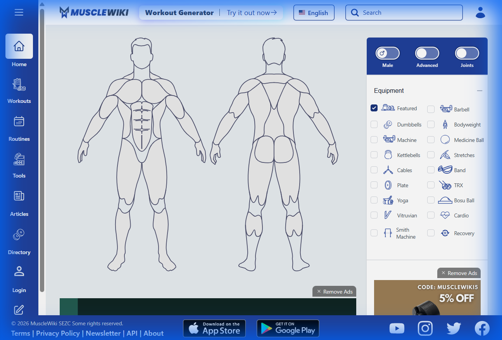
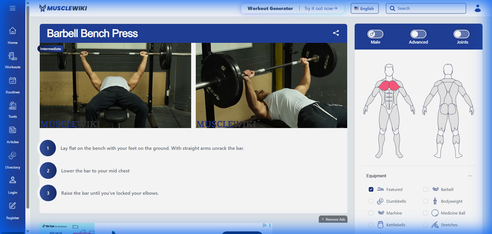

# FitTrack Database Design

> **Offline-First Architecture with Merge-Based Cloud Sync**

---

## 📐 Design Principles

1. **Offline-First** - App works fully without internet; data syncs when available
2. **Merge Conflict Resolution** - Field-level merging with timestamp comparison
3. **Soft Deletes** - No hard deletes, enables proper sync reconciliation
4. **UUID Primary Keys** - Globally unique IDs for cross-device consistency

---

## 🗄️ Entity Schema

### 1. User Entity

```kotlin
@Entity(tableName = "users")
data class User(
    @PrimaryKey 
    val id: String,                    // UUID, generated locally or from cloud
    
    // Profile
    val email: String,
    val displayName: String?,
    val avatarUrl: String?,
    
    // Gamification
    val level: Int = 1,
    val totalXp: Int = 0,
    val currentStreak: Int = 0,
    val longestStreak: Int = 0,
    
    // Timestamps
    val createdAt: Long,               // Epoch millis
    val updatedAt: Long,
    
    // Sync Metadata
    val syncId: String = id,           // Cloud document ID
    val lastSyncedAt: Long? = null,    // Last successful sync
    val syncStatus: SyncStatus = SyncStatus.PENDING,
    val isLocalOnly: Boolean = true    // True until first cloud sync
)
```

### 2. WorkoutLog Entity

```kotlin
@Entity(
    tableName = "workout_logs",
    foreignKeys = [
        ForeignKey(
            entity = User::class,
            parentColumns = ["id"],
            childColumns = ["userId"],
            onDelete = ForeignKey.CASCADE
        )
    ],
    indices = [Index("userId"), Index("syncId")]
)
data class WorkoutLog(
    @PrimaryKey 
    val id: String,                    // UUID
    val userId: String,
    
    // Workout Data
    val date: Long,                    // Epoch millis (start of day)
    val durationMinutes: Int?,
    val notes: String?,
    val xpEarned: Int = 0,
    
    // Timestamps
    val createdAt: Long,
    val updatedAt: Long,
    
    // Sync Metadata
    val syncId: String = id,
    val lastSyncedAt: Long? = null,
    val syncStatus: SyncStatus = SyncStatus.PENDING,
    val isDeleted: Boolean = false     // Soft delete
)
```

### 3. ExerciseLog Entity

```kotlin
@Entity(
    tableName = "exercise_logs",
    foreignKeys = [
        ForeignKey(
            entity = WorkoutLog::class,
            parentColumns = ["id"],
            childColumns = ["workoutLogId"],
            onDelete = ForeignKey.CASCADE
        ),
        ForeignKey(
            entity = Exercise::class,
            parentColumns = ["id"],
            childColumns = ["exerciseId"],
            onDelete = ForeignKey.SET_NULL
        )
    ],
    indices = [Index("workoutLogId"), Index("exerciseId"), Index("syncId")]
)
data class ExerciseLog(
    @PrimaryKey 
    val id: String,                    // UUID
    val workoutLogId: String,
    val exerciseId: Int?,
    
    // Set Data (JSON array or separate SetLog entity)
    val sets: String,                  // JSON: [{"weight":80,"reps":10},...]
    val totalVolume: Int,              // Calculated: sum(weight * reps)
    
    // PR Tracking
    val isPersonalRecord: Boolean = false,
    val prType: String? = null,        // "weight", "reps", "volume"
    
    // Fatigue
    val fatigueAdded: Float,           // Fatigue points added to muscles
    
    // Timestamps
    val createdAt: Long,
    val updatedAt: Long,
    
    // Sync Metadata
    val syncId: String = id,
    val lastSyncedAt: Long? = null,
    val syncStatus: SyncStatus = SyncStatus.PENDING,
    val isDeleted: Boolean = false
)
```

### 4. PersonalRecord Entity (NEW)

```kotlin
@Entity(
    tableName = "personal_records",
    foreignKeys = [
        ForeignKey(
            entity = User::class,
            parentColumns = ["id"],
            childColumns = ["userId"],
            onDelete = ForeignKey.CASCADE
        ),
        ForeignKey(
            entity = Exercise::class,
            parentColumns = ["id"],
            childColumns = ["exerciseId"],
            onDelete = ForeignKey.CASCADE
        )
    ],
    indices = [Index("userId", "exerciseId", unique = true)]
)
data class PersonalRecord(
    @PrimaryKey 
    val id: String,
    val userId: String,
    val exerciseId: Int,
    
    // PR Values
    val maxWeight: Float,
    val maxWeightDate: Long,
    val maxReps: Int,
    val maxRepsDate: Long,
    val maxVolume: Int,                // Single set volume
    val maxVolumeDate: Long,
    
    // Sync Metadata
    val updatedAt: Long,
    val syncId: String = id,
    val syncStatus: SyncStatus = SyncStatus.PENDING
)
```

### 5. SyncQueue Entity (Offline Queue)

```kotlin
@Entity(tableName = "sync_queue")
data class SyncQueueItem(
    @PrimaryKey(autoGenerate = true) 
    val id: Long = 0,
    
    val entityType: String,            // "user", "workout_log", "exercise_log"
    val entityId: String,              // UUID of the entity
    val operation: SyncOperation,      // CREATE, UPDATE, DELETE
    val payload: String,               // JSON serialized entity
    val createdAt: Long,
    val retryCount: Int = 0,
    val lastError: String? = null
)

enum class SyncOperation { CREATE, UPDATE, DELETE }
```

### 6. SyncStatus Enum

```kotlin
enum class SyncStatus {
    SYNCED,      // In sync with cloud
    PENDING,     // Local changes not yet synced
    CONFLICT,    // Merge conflict detected
    UPLOADING,   // Currently syncing
    ERROR        // Sync failed
}
```

---

## 🔄 Sync Architecture

### Merge-Based Conflict Resolution Strategy

When conflicts occur, FitTrack uses **field-level merging**:

```
┌─────────────────────────────────────────────────────────────────┐
│                    MERGE RESOLUTION FLOW                        │
├─────────────────────────────────────────────────────────────────┤
│                                                                 │
│   Local Change          Cloud Change         Merged Result      │
│   ────────────          ────────────         ─────────────      │
│   displayName: "John"   displayName: "Johnny" → "Johnny" (newer)│
│   level: 5              level: 4              → 5 (higher wins) │
│   totalXp: 1200         totalXp: 1100         → 1200 (sum diff) │
│   updatedAt: T2         updatedAt: T1         → T2              │
│                                                                 │
└─────────────────────────────────────────────────────────────────┘
```

### Merge Rules by Field Type

| Field Type | Merge Strategy | Example |
|------------|----------------|---------|
| **Text** (name, notes) | Last-write-wins (by timestamp) | Latest `displayName` |
| **Counters** (XP, streak) | Take maximum value | `max(localXp, cloudXp)` |
| **Additive** (workout logs) | Union of both sets | All unique workouts kept |
| **Timestamps** | Latest timestamp wins | `max(localUpdatedAt, cloudUpdatedAt)` |
| **Boolean flags** | OR for positive, AND for negative | `isDeleted = local OR cloud` |

### Sync Flow Diagram

```
┌──────────────┐          ┌──────────────┐          ┌──────────────┐
│   LOCAL DB   │          │  SYNC ENGINE │          │    CLOUD     │
│    (Room)    │          │              │          │  (Backend)   │
└──────┬───────┘          └──────┬───────┘          └──────┬───────┘
       │                         │                         │
       │  1. Get pending items   │                         │
       │ ───────────────────────>│                         │
       │                         │                         │
       │                         │  2. Fetch cloud changes │
       │                         │ ───────────────────────>│
       │                         │                         │
       │                         │  3. Cloud data          │
       │                         │ <───────────────────────│
       │                         │                         │
       │                         │  4. Merge & resolve     │
       │                         │      conflicts          │
       │                         │                         │
       │  5. Write merged data   │                         │
       │ <───────────────────────│                         │
       │                         │                         │
       │                         │  6. Push local changes  │
       │                         │ ───────────────────────>│
       │                         │                         │
       │  7. Mark as SYNCED      │                         │
       │ <───────────────────────│                         │
       │                         │                         │
```

---

## ☁️ Cloud Backend Options
## ☁️ Cloud Backend: Supabase (PostgreSQL)

> **Decision: Supabase** was chosen for its relational power, open-source nature, and compatibility with our offline-first Room architecture.

### Why Supabase?

| Requirement | Supabase Fit |
|-------------|--------------|
| **Relational Queries** | ✅ Native PostgreSQL for complex fatigue/PR analytics |
| **No Vendor Lock-in** | ✅ Open-source, self-hostable |
| **Row-Level Security** | ✅ Fine-grained access control at database level |
| **Auto-generated APIs** | ✅ REST + GraphQL out of the box |
| **Real-time Subscriptions** | ✅ Built-in for live sync |
| **Free Tier** | ✅ 500MB database, 2GB bandwidth |

---

### Offline-First Architecture

```
┌────────────────────────────────────────────────────────────────────────┐
│                    OFFLINE-FIRST ARCHITECTURE                          │
├────────────────────────────────────────────────────────────────────────┤
│                                                                        │
│  User Action ──▶ Room DB ──▶ UI Updates Instantly                      │
│       │           (Local Truth)                                        │
│       │                │                                               │
│       │                ▼                                               │
│       │         ┌──────────────┐                                       │
│       │         │  SyncQueue   │  Action Queued                        │
│       │         │  (Pending)   │                                       │
│       │         └──────┬───────┘                                       │
│       │                │                                               │
│       │                │ Connection Returns                            │
│       │                ▼                                               │
│       │         ┌──────────────┐                                       │
│       │         │ WorkManager  │  Background Sync                      │
│       │         │ (SyncWorker) │                                       │
│       │         └──────┬───────┘                                       │
│       │                │                                               │
│       │                ▼                                               │
│       │         ┌──────────────┐     ┌──────────────┐                  │
│       └────────▶│ SyncManager  │────▶│   Supabase   │                  │
│                 │ (Merge Logic)│◀────│ (PostgreSQL) │                  │
│                 └──────────────┘     └──────────────┘                  │
│                        │                                               │
│                        ▼                                               │
│                 Server Confirms ──▶ Local DB Clears Queue Item         │
│                                                                        │
└────────────────────────────────────────────────────────────────────────┘
```

---

### PostgreSQL Schema (Supabase)

```sql
-- =============================================
-- FITTRACK SUPABASE SCHEMA
-- =============================================

-- Enable UUID extension
CREATE EXTENSION IF NOT EXISTS "uuid-ossp";

-- =============================================
-- USERS TABLE
-- =============================================
CREATE TABLE users (
    id UUID PRIMARY KEY DEFAULT uuid_generate_v4(),
    email TEXT UNIQUE NOT NULL,
    display_name TEXT,
    avatar_url TEXT,
    
    -- Gamification
    level INTEGER DEFAULT 1,
    total_xp INTEGER DEFAULT 0,
    current_streak INTEGER DEFAULT 0,
    longest_streak INTEGER DEFAULT 0,
    
    -- Timestamps
    created_at TIMESTAMPTZ DEFAULT NOW(),
    updated_at TIMESTAMPTZ DEFAULT NOW()
);

-- =============================================
-- WORKOUT LOGS TABLE
-- =============================================
CREATE TABLE workout_logs (
    id UUID PRIMARY KEY DEFAULT uuid_generate_v4(),
    user_id UUID REFERENCES users(id) ON DELETE CASCADE,
    
    -- Workout Data
    date DATE NOT NULL,
    duration_minutes INTEGER,
    notes TEXT,
    xp_earned INTEGER DEFAULT 0,
    
    -- Timestamps
    created_at TIMESTAMPTZ DEFAULT NOW(),
    updated_at TIMESTAMPTZ DEFAULT NOW(),
    
    -- Soft delete
    is_deleted BOOLEAN DEFAULT FALSE
);

CREATE INDEX idx_workout_logs_user_id ON workout_logs(user_id);
CREATE INDEX idx_workout_logs_date ON workout_logs(date);

-- =============================================
-- EXERCISE LOGS TABLE
-- =============================================
CREATE TABLE exercise_logs (
    id UUID PRIMARY KEY DEFAULT uuid_generate_v4(),
    workout_log_id UUID REFERENCES workout_logs(id) ON DELETE CASCADE,
    exercise_id INTEGER,
    
    -- Set Data (JSONB for flexibility)
    sets JSONB NOT NULL, -- [{"weight": 80, "reps": 10}, ...]
    total_volume INTEGER,
    
    -- PR Tracking
    is_personal_record BOOLEAN DEFAULT FALSE,
    pr_type TEXT, -- 'weight', 'reps', 'volume'
    
    -- Fatigue
    fatigue_added REAL,
    
    -- Timestamps
    created_at TIMESTAMPTZ DEFAULT NOW(),
    updated_at TIMESTAMPTZ DEFAULT NOW(),
    is_deleted BOOLEAN DEFAULT FALSE
);

CREATE INDEX idx_exercise_logs_workout ON exercise_logs(workout_log_id);

-- =============================================
-- PERSONAL RECORDS TABLE
-- =============================================
CREATE TABLE personal_records (
    id UUID PRIMARY KEY DEFAULT uuid_generate_v4(),
    user_id UUID REFERENCES users(id) ON DELETE CASCADE,
    exercise_id INTEGER NOT NULL,
    
    -- PR Values
    max_weight REAL,
    max_weight_date DATE,
    max_reps INTEGER,
    max_reps_date DATE,
    max_volume INTEGER,
    max_volume_date DATE,
    
    -- Timestamps
    updated_at TIMESTAMPTZ DEFAULT NOW(),
    
    UNIQUE(user_id, exercise_id)
);

-- =============================================
-- ROW LEVEL SECURITY
-- =============================================
ALTER TABLE users ENABLE ROW LEVEL SECURITY;
ALTER TABLE workout_logs ENABLE ROW LEVEL SECURITY;
ALTER TABLE exercise_logs ENABLE ROW LEVEL SECURITY;
ALTER TABLE personal_records ENABLE ROW LEVEL SECURITY;

-- Users can only access their own data
CREATE POLICY "Users access own data" ON users
    FOR ALL USING (auth.uid() = id);

CREATE POLICY "Users access own workouts" ON workout_logs
    FOR ALL USING (auth.uid() = user_id);

CREATE POLICY "Users access own exercise logs" ON exercise_logs
    FOR ALL USING (
        workout_log_id IN (
            SELECT id FROM workout_logs WHERE user_id = auth.uid()
        )
    );

CREATE POLICY "Users access own PRs" ON personal_records
    FOR ALL USING (auth.uid() = user_id);

-- =============================================
-- UPDATED_AT TRIGGER
-- =============================================
CREATE OR REPLACE FUNCTION update_updated_at()
RETURNS TRIGGER AS $$
BEGIN
    NEW.updated_at = NOW();
    RETURN NEW;
END;
$$ LANGUAGE plpgsql;

CREATE TRIGGER users_updated_at
    BEFORE UPDATE ON users
    FOR EACH ROW EXECUTE FUNCTION update_updated_at();

CREATE TRIGGER workout_logs_updated_at
    BEFORE UPDATE ON workout_logs
    FOR EACH ROW EXECUTE FUNCTION update_updated_at();

CREATE TRIGGER exercise_logs_updated_at
    BEFORE UPDATE ON exercise_logs
    FOR EACH ROW EXECUTE FUNCTION update_updated_at();
```

---

### Supabase Android Integration

```kotlin
// build.gradle.kts (app)
dependencies {
    implementation("io.github.jan-tennert.supabase:postgrest-kt:2.0.0")
    implementation("io.github.jan-tennert.supabase:gotrue-kt:2.0.0")
    implementation("io.github.jan-tennert.supabase:realtime-kt:2.0.0")
    implementation("io.ktor:ktor-client-android:2.3.0")
}
```

```kotlin
// SupabaseClient.kt
object SupabaseClient {
    val client = createSupabaseClient(
        supabaseUrl = BuildConfig.SUPABASE_URL,
        supabaseKey = BuildConfig.SUPABASE_ANON_KEY
    ) {
        install(Postgrest)
        install(GoTrue) {
            flowType = FlowType.PKCE
            scheme = "fittrack"
            host = "login"
        }
        install(Realtime)
    }
}
```

```kotlin
// CloudDataSource.kt
class SupabaseDataSource @Inject constructor() : CloudDataSource {

    private val client = SupabaseClient.client

    override suspend fun fetchWorkouts(userId: String, since: Long): List<WorkoutLog> {
        return client.postgrest["workout_logs"]
            .select {
                filter { eq("user_id", userId) }
                filter { gte("updated_at", Instant.fromEpochMilliseconds(since).toString()) }
            }
            .decodeList<WorkoutLogDto>()
            .map { it.toDomain() }
    }

    override suspend fun pushWorkouts(workouts: List<WorkoutLog>) {
        client.postgrest["workout_logs"]
            .upsert(workouts.map { it.toDto() })
    }
    
    override suspend fun subscribeToChanges(userId: String): Flow<RealtimeChange> {
        return client.realtime
            .channel("workout_changes")
            .postgresChangeFlow<PostgresAction>("workout_logs") {
                filter("user_id", FilterOperator.EQ, userId)
            }
    }
}

---

## 🏗️ Implementation Components

### Repository Layer

```kotlin
interface SyncableRepository<T> {
    suspend fun getById(id: String): T?
    suspend fun getAll(): Flow<List<T>>
    suspend fun insert(entity: T)
    suspend fun update(entity: T)
    suspend fun softDelete(id: String)
    suspend fun getPendingSync(): List<T>
    suspend fun markSynced(id: String, syncedAt: Long)
}

class WorkoutRepository @Inject constructor(
    private val workoutDao: WorkoutDao,
    private val syncQueue: SyncQueueDao
) : SyncableRepository<WorkoutLog> {
    // Implementation with automatic sync queue management
}
```

### Sync Manager

```kotlin
class SyncManager @Inject constructor(
    private val cloudDataSource: CloudDataSource,
    private val localDatabase: AppDatabase,
    private val conflictResolver: ConflictResolver,
    private val connectivityObserver: ConnectivityObserver
) {
    suspend fun syncAll(): SyncResult
    suspend fun syncEntity(type: String, id: String): SyncResult
    fun observeSyncStatus(): Flow<SyncStatus>
}
```

### WorkManager Integration

```kotlin
class SyncWorker(
    context: Context,
    params: WorkerParameters
) : CoroutineWorker(context, params) {

    override suspend fun doWork(): Result {
        return try {
            syncManager.syncAll()
            Result.success()
        } catch (e: Exception) {
            if (runAttemptCount < 3) Result.retry()
            else Result.failure()
        }
    }
}

// Schedule periodic sync
val syncRequest = PeriodicWorkRequestBuilder<SyncWorker>(
    15, TimeUnit.MINUTES
).setConstraints(
    Constraints.Builder()
        .setRequiredNetworkType(NetworkType.CONNECTED)
        .build()
).build()

WorkManager.getInstance(context).enqueueUniquePeriodicWork(
    "fittrack_sync",
    ExistingPeriodicWorkPolicy.KEEP,
    syncRequest
)
```

### Connectivity Observer

```kotlin
class ConnectivityObserver @Inject constructor(
    private val context: Context
) {
    fun observe(): Flow<ConnectionState> = callbackFlow {
        val manager = context.getSystemService<ConnectivityManager>()
        val callback = object : ConnectivityManager.NetworkCallback() {
            override fun onAvailable(network: Network) {
                trySend(ConnectionState.CONNECTED)
            }
            override fun onLost(network: Network) {
                trySend(ConnectionState.DISCONNECTED)
            }
        }
        manager?.registerDefaultNetworkCallback(callback)
        awaitClose { manager?.unregisterNetworkCallback(callback) }
    }
}

enum class ConnectionState { CONNECTED, DISCONNECTED }
```

---

## 📊 Entity Relationship Diagram

```
┌─────────────────────────────────────────────────────────────────────────────┐
│                           FitTrack Database Schema                          │
└─────────────────────────────────────────────────────────────────────────────┘

┌──────────────┐         ┌─────────────────┐         ┌─────────────────┐
│    User      │────1:N──│   WorkoutLog    │────1:N──│   ExerciseLog   │
│──────────────│         │─────────────────│         │─────────────────│
│ id (PK)      │         │ id (PK)         │         │ id (PK)         │
│ email        │         │ userId (FK)     │         │ workoutLogId(FK)│
│ displayName  │         │ date            │         │ exerciseId (FK) │
│ level        │         │ durationMinutes │         │ sets (JSON)     │
│ totalXp      │         │ xpEarned        │         │ totalVolume     │
│ syncStatus   │         │ syncStatus      │         │ isPersonalRecord│
└──────┬───────┘         └─────────────────┘         │ syncStatus      │
       │                                              └────────┬────────┘
       │                                                       │
       │                                                       │
       │         ┌─────────────────┐         ┌─────────────────┤
       │         │ PersonalRecord  │         │                 │
       └────1:N──│─────────────────│         │    ┌────────────┴────────┐
                 │ id (PK)         │         │    │     Exercise        │
                 │ userId (FK)     │─────────┘    │─────────────────────│
                 │ exerciseId (FK) │──────────────│ id (PK)             │
                 │ maxWeight       │              │ name                │
                 │ maxReps         │              │ muscleGroups        │
                 │ maxVolume       │              │ equipment           │
                 │ syncStatus      │              │ difficulty          │
                 └─────────────────┘              └─────────────────────┘

                 ┌─────────────────┐
                 │   SyncQueue     │
                 │─────────────────│
                 │ id (PK)         │  ← Offline operation queue
                 │ entityType      │
                 │ entityId        │
                 │ operation       │
                 │ payload (JSON)  │
                 │ retryCount      │
                 └─────────────────┘
```

---

## 🔐 Authentication Flow

```
┌────────────────────────────────────────────────────────────────────┐
│                     AUTH + SYNC FLOW                               │
├────────────────────────────────────────────────────────────────────┤
│                                                                    │
│  ┌─────────┐    ┌──────────────┐    ┌────────────┐    ┌─────────┐ │
│  │  App    │───>│ Login Screen │───>│ Auth Check │───>│ Success │ │
│  │ Launch  │    │              │    │            │    │         │ │
│  └─────────┘    └──────────────┘    └─────┬──────┘    └────┬────┘ │
│                                           │                 │      │
│                        ┌──────────────────┘                 │      │
│                        ▼                                    ▼      │
│              ┌──────────────────┐              ┌──────────────────┐│
│              │  Offline Mode    │              │  Initial Sync    ││
│              │  (Local only)    │              │  (Pull + Merge)  ││
│              └──────────────────┘              └──────────────────┘│
│                                                                    │
└────────────────────────────────────────────────────────────────────┘
```

---

## ✅ Implementation Checklist

### Phase 1: Local Database Updates
- [ ] Add sync fields to existing Room entities (`syncId`, `syncStatus`, `lastSyncedAt`)
- [ ] Create `SyncQueue` entity for offline operation queue
- [ ] Create `PersonalRecord` entity for PR tracking
- [ ] Add Room database migrations (version upgrade)

### Phase 2: Sync Infrastructure
- [ ] Create `SyncManager` orchestration class
- [ ] Create `ConflictResolver` with field-level merge logic
- [ ] Create `ConnectivityObserver` using Flow
- [ ] Implement `SyncWorker` with WorkManager (15-min periodic)

### Phase 3: Supabase Integration
- [ ] Create Supabase project and run SQL schema
- [ ] Add Supabase Android SDK dependencies
- [ ] Implement `SupabaseDataSource` with Postgrest
- [ ] Configure Row-Level Security policies
- [ ] Test sync with real Supabase instance

### Phase 4: Auth Integration
- [ ] Implement Supabase GoTrue authentication
- [ ] Add Google/Apple social login
- [ ] Handle multi-device user scenarios
- [ ] Implement logout + local data handling

---

## 🔍 Competitive Analysis: FitTrack vs MuscleWiki

### About MuscleWiki

[MuscleWiki](https://musclewiki.com) is a comprehensive fitness encyclopedia with:
- **2,000+ exercises** with video demonstrations
- **Interactive muscle map** (male/female, front/back views)
- **Workout generator** based on selected muscles and equipment
- **Fitness calculators** (Calorie, Macro, One Rep Max)
- **14 language support** with global reach

### Homepage Comparison



MuscleWiki's homepage features a clean, clinical "wiki-style" interface with:
- SVG-based interactive anatomy diagrams
- Equipment filter panel on the right
- Male/Female and Standard/Advanced/Joints toggles
- Dark blue color scheme (#2299DD as primary)

### Exercise Detail Comparison



MuscleWiki exercise pages include:
- Side-by-side video loops (start/end positions)
- Numbered step-by-step instructions
- Small anatomy diagram showing targeted muscles
- Difficulty and equipment labels

---

### Feature Comparison Matrix

| Feature | MuscleWiki | FitTrack |
|---------|-----------|----------|
| **Primary Focus** | Encyclopedia / Reference | Personal Progress / Gamification |
| **Exercise Library** | 2,000+ exercises | 29 exercises (expandable) |
| **Muscle Map** | ✅ Standard + Advanced (paywall) | ✅ Fatigue Heatmap (free) |
| **Video Demonstrations** | ✅ Professional loops | ❌ Not yet |
| **Workout Generation** | ✅ Muscle + Equipment based | 🔄 Planned |
| **Logging/Tracking** | ✅ Basic (limited free) | ✅ Full with undo |
| **Fatigue System** | ❌ None | ✅ 72-hour decay algorithm |
| **Personal Records** | ❌ None | 🔄 Proposed |
| **Gamification (XP/Levels)** | ❌ None | 🔄 Proposed |
| **Rest Timer** | ❌ None | 🔄 Proposed |
| **Recovery Advisor** | ❌ None | 🔄 Proposed |
| **Streak Tracking** | ❌ None | ✅ Daily streaks |
| **Offline Mode** | ✅ Premium only | ✅ Full offline |
| **Platform** | Web-first | Android-first (mobile) |
| **Monetization** | Freemium (Premium $9.99/mo) | TBD |

---

### Strategic Differentiation

#### What MuscleWiki Does Better
1. **Content Volume** - Massive exercise library with professional videos
2. **SEO & Discovery** - Well-indexed, searchable exercise database
3. **Multi-language** - 14 languages, global audience
4. **Fitness Tools** - Calculators for macros, calories, 1RM

#### FitTrack's Competitive Advantages

| Advantage | Description |
|-----------|-------------|
| **Fatigue Intelligence** | Real-time muscle recovery tracking - MuscleWiki tells you *what* to do, FitTrack tells you *when* |
| **Recovery Advisor** | "Which muscle should I train?" recommendations based on your actual fatigue state |
| **Gamification** | XP, levels, badges, and streaks drive user retention and consistency |
| **Mobile-First UX** | Designed for logging in the gym, not reading at a desk |
| **Offline-First** | Full functionality without internet (not paywalled) |
| **PR Detection** | Auto-celebrate personal records with motivational feedback |

---

### Design Philosophy Comparison

```
┌─────────────────────────────────────────────────────────────────────┐
│                     PRODUCT POSITIONING                             │
├─────────────────────────────────────────────────────────────────────┤
│                                                                     │
│   MuscleWiki                          FitTrack                      │
│   ──────────                          ────────                      │
│   📚 "Learn what exercises exist"     💪 "Track your progress"      │
│   🔍 Reference tool                   📈 Personal coach             │
│   🖥️  Desktop-optimized               📱 Mobile-first               │
│   📖 Encyclopedic & clinical          🎮 Gamified & engaging        │
│   🎨 Blue/white clinical theme        🔥 Energetic warm colors      │
│                                                                     │
└─────────────────────────────────────────────────────────────────────┘
```

---

### Recommended Visual Differentiation

| Element | MuscleWiki | FitTrack (Recommended) |
|---------|-----------|------------------------|
| **Color Scheme** | Clinical blue (#2299DD) | Energetic gradient (orange → red) |
| **Muscle Map Style** | Static anatomy | Dynamic heatmap with glow effects |
| **Iconography** | Minimal, utilitarian | Gamified (badges, flames, trophies) |
| **Animations** | Subtle transitions | Celebratory micro-animations (PRs, streaks) |
| **Typography** | Roboto, Inter (neutral) | Bold, sporty fonts |

---

### Key Takeaways

> [!IMPORTANT]
> **The Fatigue Heatmap is FitTrack's "killer feature"** - MuscleWiki helps users find exercises, but FitTrack's Recovery Advisor tells them *which muscle is ready to train* based on actual logged data. This is a significant competitive advantage.

> [!TIP]
> **Don't compete on content volume** - Instead of building 2,000 exercises, focus on the 50-100 most common exercises with excellent UX. Let MuscleWiki be the encyclopedia; FitTrack should be the personal coach.

---

## ✅ Decision Made

**Backend: Supabase (PostgreSQL)** was selected for:
- Relational power for complex fatigue/PR analytics
- Open-source, no vendor lock-in
- Compatibility with offline-first Room architecture
- Auto-generated REST/GraphQL APIs

**Architecture: Offline-First** with:
- Room as local source of truth
- SyncQueue for pending actions
- WorkManager for background sync
- Field-level merge conflict resolution

